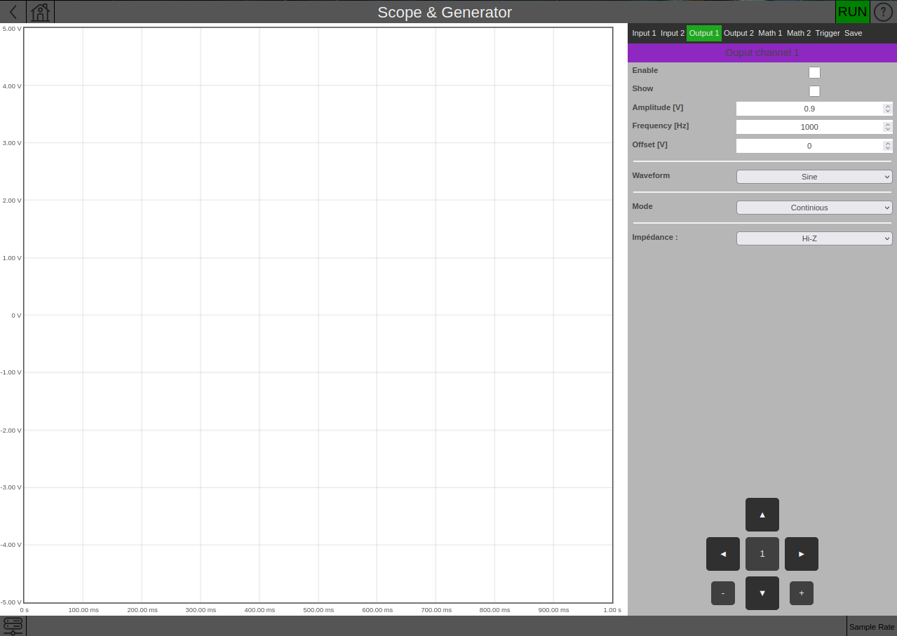

### Development web page
Development of minimal application to create an oscilloscope and analog generator with a web interface for a red pitaya




#### Structure

* index.html - main page of the module that starts when the application starts
* fpga.conf - path to fpg firmware, loaded automatically when module starts
* nginx.conf - nginx configuration file
* (js, info, img, css) - folders containing files for the site
* src - folder containing the source code on c ++, which is executed on redpitaya


#### Build

To build a project, execute the command in red pitaya OS 2.0:

```
bash b.sh
```


